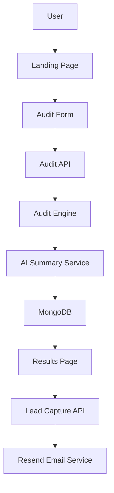

# System Architecture

---

# Data Flow

1. User enters AI tools and spending data.
2. Frontend sends data to `/api/audit`.
3. Audit engine evaluates pricing and optimization opportunities.
4. AI summary service generates personalized executive summary.
5. Audit stored in MongoDB.
6. Unique public URL generated.
7. Results displayed on `/results/[id]`.
8. User can optionally submit email through lead form.
9. Confirmation email sent through Resend.

---

# Why I Chose This Stack

## Next.js

* Server APIs
* SSR support
* Excellent deployment workflow
* Modern React ecosystem

## MongoDB

* Flexible schema
* Fast iteration
* Simple integration with Mongoose

## Tailwind CSS

* Fast UI development
* Consistent design system
* Responsive styling

## Groq + OpenRouter

* Free AI inference access
* Fast response times
* Reliable fallback architecture

---

# Scaling to 10k Audits/Day

If this project had to support 10k audits/day:

* Add Redis caching
* Move audit processing to queues
* Use edge caching for results pages
* Add rate limiting middleware
* Separate AI summary service into workers
* Use MongoDB indexing aggressively
* Add CDN caching

---